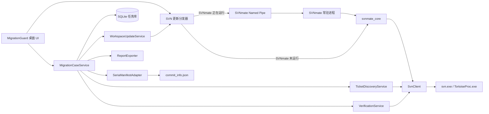

# 海外迁移核验助手：技术与交互设计

## 1. 设计结论

建议把新工具做成 **SVNmate 的独立 Windows 工具模块**，而不是继续把逻辑塞入
Unreal Editor。

- 产品形态：`MigrationGuard.exe`
- 技术栈：Python 3.11、Tkinter/ttk、标准库 SQLite、PyInstaller
- 启动入口：SVNmate 的“工具模块”区域
- SVNmate 常驻时：通过 Windows Named Pipe 请求 SVNmate 更新指定目录
- SVNmate 未运行时：由迁移核验助手直接调用共享的 `svnmate_core`
- UE 集成：通过 OmniMcpCore 一次调用现有
  `SeriaMigrateInfo.migrate_by_package_names`
- 提交策略：打开 TortoiseSVN 提交窗口，提交后由新工具重新查询仓库验证

迁移核验助手不会驱动 SVNmate GUI，而是调用 SVNmate 提供的结构化 IPC。GUI、
IPC 和无进程回退都使用同一套 core，因此不会复制 Update/Cleanup 规则。

### 1.1 当前实现状态

已完成第一批基础设施：

- `svnmate_core/update.py`：无 UI 的批量更新、Cleanup 和单次重试。
- `svnmate_ipc.py`：Windows Named Pipe 请求协议与客户端/服务端。
- `svn_auto_tool.py`：常驻 IPC 服务、忙碌保护和结构化结果返回。
- `migration_guard/svn_update_client.py`：IPC 优先、core 回退的统一入口。
- `migration_guard/svn_client.py`：SVN info/log/status/externals 的 XML 读取。
- `migration_guard/audit.py`：源文件、目标本地状态和海外提交证据核验。
- `migration_guard/app.py`：Windows 桌面界面、筛选、详情和 JSON 导出。
- `migration_guard/ticket_mapping.py`：飞书合并表读取、SERIA/OSCOA 双向映射、路线
  分段和离线缓存。
- `migration_guard/selective_update.py`：按源清单和远端状态生成最小更新目录集合。
- `migration_guard/ue_client.py`：OmniMcpCore 长度前缀协议和 UE 工程校验。
- `migration_guard/batch_workflow.py`：资源去重与用户选择、海外 Jira 提交分组和
  窗口等待。

当前尚未实现源文件后续提交漂移提示、表格语义差异和 UE 依赖资源的精确 Jira
归属。

## 2. 现有实现分析

### 2.1 SVNmate

仓库中的 `svn_auto_tool.py` 已具备：

- 多工作目录配置和持久化。
- TortoiseSVN / `svn.exe` 自动发现。
- Update 失败后 Cleanup，再重试一次。
- SVN Update 串行执行。
- 后台任务、实时日志、磁盘日志和任务完成通知。
- Windows 单实例、托盘、DPI 和 PyInstaller 打包。
- 独立工具模块的安装、更新和启动机制。

可直接复用的行为集中在：

- `svn_auto_tool.py:2128-2175`：批量工作区执行流水线。
- `svn_auto_tool.py:2296-2331`：TortoiseSVN 与 SVN CLI 命令构造。
- `svn_auto_tool.py:2333-2391`：执行、错误记录、Cleanup 和单次重试。
- `tool_modules.py`：独立 EXE 模块管理。

原实现的限制是这些能力全部位于 `SvnAutoTool` UI 类中。当前已把
Update -> Cleanup -> 单次重试抽取到纯 Python core，批处理脚本和
TortoiseSVN 窗口控制仍保留在 SVNmate 进程内。

### 2.2 SeriaMigrate

`C:\trunk\res\Content\Python\MigrateTool\SeriaMigrate.py` 的实际流程是：

1. 从命令行参数接收一个或多个 Jira 描述。
2. 使用 Jira 创建时间推导 SVN 查询天数。
3. 按天调用 `svn log -v --xml` 获取提交。
4. 按 Jira 正则和可选作者过滤提交。
5. 汇总变更路径并排除最终状态为删除的文件。
6. 将 `.uasset/.umap` 路径转换为 `/Game/...` 包名。
7. 调用 `UE4.SeriaMigrateInfo.migrate_by_package_names`。
8. 对表格给出提醒，对其他非 UAsset 文件按路径复制。
9. 在源工程和分支目录写出 `commit_info.json`。

可复用能力：

| 能力 | 复用方式 |
| --- | --- |
| Jira 单号格式与国内/海外映射概念 | 迁移到独立配置和严格解析器 |
| SVN XML 日志中的 revision/action/path | 重新实现为无 UE 依赖的领域模型 |
| SVN 路径到 `/Game` 包名转换 | 保留规则，增加单元测试 |
| `migrate_by_package_names` | 继续作为 UE 资产迁移执行器 |
| `commit_info.json` | 作为兼容输入，不作为唯一事实源 |
| 表格、普通文件、UAsset 分类 | 迁移到可配置策略 |

不能直接复用的部分：

- `SVNUtil` 是全局可变单例，并和 UE 对话框耦合。
- 命令以字符串和 `shell=True` 执行，参数引用和退出码不可靠。
- 按天查询会产生大量 SVN 请求。
- 作者使用子串匹配，可能漏掉同单号的其他提交人。
- 只保留未删除文件，无法正确核验删除迁移。
- 多处可变默认参数会在多任务间残留数据。
- 异常被静默吞掉时会把“查询失败”表现成“没有文件”。
- `commit_info.json` 只记录源直接变更，不记录 UE 实际迁移的依赖。

### 2.3 CheckValidCommit

`CheckValidCommit.py` 已尝试完成迁移后的检查：

1. 读取源工程的 `commit_info.json`。
2. 把源仓库路径替换成分支本地路径。
3. 对目标文件执行 `svn status`。
4. 收集有本地变更的文件并打开 TortoiseSVN 提交窗口。
5. 没有清单可用时，比较主干与分支中同 Jira 单号对应的 UAsset 集合。

它不能作为最终闭环，原因包括：

- 只要存在任意待提交文件，就提前结束，不检查清单中其他文件是否漏迁。
- 启动提交窗口后立即把流程视为有效，无法知道提交是否取消或失败。
- 目标提交通常使用海外单号，不能用源单号直接比较两侧日志。
- “目标文件无本地修改”会被显示为无变更，但无法区分已提交和从未迁移。
- 集合回退只比较 UAsset，脚本、表格和删除项会缺失。
- 路径依赖字符串替换，无法可靠处理 `doc` 根层级和 SVN externals。
- `svnutil.ex_path` 被赋值为字符串后会按字符遍历，属于明显的不稳定路径。
- 未检查 SVN 命令退出码，失败可能被误判为空结果。

### 2.4 SeriaTableUtil

`SeriaTableUtil.py` 提供了按源 revision 合并 CSV/XML 差异、把 CSV 变更应用到
XLSM、检查列变化和提示新表的能力。它适合作为“表格迁移执行器”，但不能直接作为
通用核验器：

- 路径和示例 Jira 存在历史硬编码。
- 使用 revert 和 merge，风险高于只读核验。
- CSV 到 XLSM 可能是一对多映射。
- 新表和列结构变化仍要求人工处理。

MVP 只导入其映射概念和结果，不自动调用其中的 revert/merge。

### 2.5 现有审计脚本

`C:\trunk\svn_commit_audit.ps1` 已证明可以直接对 SVN URL 执行
`svn log --xml -v --search`，解析提交和变更路径。新工具应使用同类 XML 数据源，
但按单号、模块和任务聚合，而不是按作者和时间统计。

## 3. 需要补齐的关键能力

### 3.1 两类证据

每个文件必须同时保留：

- **迁移证据**：目标工作副本出现了与该任务相关的本地状态。
- **提交证据**：目标仓库存在海外单号提交，且提交路径包含该文件。

迁移证据会随着提交消失，因此不能只看当前 `svn status`。提交证据不能证明当前
工作副本没有后续未提交修改，因此两类证据必须合并判定。

### 3.2 源快照与源漂移

现有 UE 工具按 Jira 找到文件后迁移当前工作副本中的最新资产，而不是迁移该 Jira
revision 当时的二进制内容。若同一路径在该 Jira 之后又被其他提交修改，实际迁移
可能包含额外内容。

新工具应为每个源文件记录：

- 本任务最后一个源 revision。
- 扫描时该路径最新 revision。
- 两者之间是否存在其他 Jira 的提交。

存在后续提交时显示“源已漂移”，要求用户确认迁移当前最新版是否符合预期。

### 3.3 额外目标改动

UE 资产迁移可能带入依赖，而 `commit_info.json` 没有这些路径。目标状态扫描中出现
清单外改动时，统一显示为“额外改动”，用户必须：

- 归入当前任务；
- 关联到其他任务；
- 或明确排除。

工具不得默认把所有目标本地修改加入提交。

## 4. 总体架构



常驻 SVNmate 使用其现有 TortoiseSVN 执行器；无进程回退使用 `svn.exe`。两条路径
共用 Update -> Cleanup -> 单次重试编排，并返回相同结构的结果。所有 SVN 读操作
仍优先使用 `svn.exe`，因为它能提供机器可解析的 XML 和明确退出码。

### 4.1 调用选择

```text
尝试连接 \\.\pipe\SVNmate.Command.v1
  ├─ 成功：向 SVNmate 发送 update 请求并等待结构化结果
  ├─ 失败，但检测到 SVNmate 单实例锁：阻断并要求重启新版 SVNmate
  └─ 失败，且 SVNmate 未运行：直接调用 svnmate_core
```

第二种情况不能回退到 core，否则可能有两个进程同时更新同一工作副本。

## 5. 代码布局

当前基础设施与后续计划目录：

```text
migration_guard/
  app.py                       # 已实现
  audit.py                     # 已实现
  config.py                    # 已实现
  models.py                    # 已实现
  svn_client.py                # 已实现
  ticket_mapping.py            # 已实现
  svn_update_client.py         # 已实现
svnmate_core/
  update.py                    # 已实现
svnmate_ipc.py                 # 已实现
```

`svnmate_core` 不导入 Tkinter，也不访问全局 `StringVar`。SVNmate 和
MigrationGuard 分别订阅结构化进度事件并更新自己的 UI。

## 6. 核心数据模型

### WorkspaceProfile

```text
id
name
source_modules[]: module, local_root, expected_url_pattern
target_modules[]: module, local_root, expected_url_pattern
issue_rules: source_pattern, target_pattern
table_rules[]
```

路径不应只保存 `C:\trunk` 或 `D:\Oversea`。每个 `bin/doc/res` 都是独立 SVN
工作副本，必须分别执行 `svn info` 并保存仓库相对根。

### MigrationCase

```text
case_id
source_issue
target_issue
profile_id
state
created_at
source_snapshot_revision_by_module
source_manifest_hash
last_verified_at
```

### ExpectedChange

```text
module
repository_uuid
source_repository_path
source_relative_path
source_action
source_revisions[]
source_authors[]
source_last_changed_revision
target_repository_path
target_local_path
category
required
```

### VerificationEvidence

```text
working_copy_status
repository_status
target_ticket_revisions[]
other_ticket_revisions[]
target_last_changed_revision
exists_on_disk
parent_versioning_status
source_drift_revisions[]
decision
reason
```

## 7. SVN 命令策略

所有参数使用数组传递给 `subprocess`，不使用 `shell=True` 拼接用户输入。

### 环境与路径

```text
svn info --xml <working-copy>
svn info --show-item wc-root <path>
svn info --show-item repos-root-url <path>
```

### 更新

```text
svn update --accept postpone <working-copy>
svn cleanup <working-copy>
```

Update 失败后只 Cleanup 和重试一次。默认不使用 `--break-locks`；只有用户明确选择
强制恢复时才调用 TortoiseSVN 的对应能力。

迁移核验助手不会默认更新整个模块根目录。它先读取提交日志形成源清单，再对清单文件
执行 `svn status --show-updates`，只更新落后文件所在的最近存在目录。目标侧只处理
核验状态为“需更新”的路径。候选目录会去重并消除被父目录覆盖的子目录；无法定位
路径或候选数超过 IPC 上限时，才保守回退到模块根目录。

### 源单扫描

```text
svn log --xml -v --search *<SOURCE_KEY>* -r <START>:HEAD <module-url>
```

不能同时用很小的 `-l` 限制搜索，否则旧的匹配提交可能被截断。XML 返回后必须再次
用严格的单号边界匹配提交说明。

### 目标提交扫描

```text
svn log --xml -v --search *<TARGET_KEY>* -r <CASE_START>:HEAD <module-url>
```

海外单号是主关联键；提交说明中的源单号、源 revision 或批次哈希作为增强证据。

### 本地状态

```text
svn status --xml <expected-paths...>
svn status --xml --show-updates <minimal-common-parent>
```

对新增路径逐级查询父目录。对 externals 先执行 `svn info`，再使用 external 自己
的 URL 和工作副本根。

## 8. 路径映射

路径映射基于“模块 + 相对于模块仓库根的路径”，不使用字符串替换完整绝对路径。

示例：

```text
source module root: ^/Project/res/trunk
source path:        ^/Project/res/trunk/Content/Game/A.uasset
relative path:      Content/Game/A.uasset
target module root: ^/Project/res/overseas/trunk
target path:        ^/Project/res/overseas/trunk/Content/Game/A.uasset
```

每个模块在保存配置时执行一次映射探测：

1. 源和目标仓库 UUID 必须一致。
2. 源、目标模块类型必须一致。
3. 相对路径不能越出工作副本根。
4. externals 单独建映射，不继承父工作副本 URL。
5. 映射结果必须能反向还原，否则配置无效。

表格允许配置扩展映射，例如一个源 CSV 同时要求检查目标 CSV 和对应 XLSM。

## 9. 源清单算法

1. 按模块查询包含源单号的全部日志。
2. 严格解析单号，不使用作者过滤删除结果。
3. 按 `(repository_uuid, repository_path)` 聚合动作。
4. 保存每次提交，不丢弃中间 revision。
5. 计算任务前后是否存在该节点，得出净动作：

| 提交序列 | 净动作 |
| --- | --- |
| A | add |
| M... | modify |
| D | delete |
| A...D，任务前后均不存在 | no-op |
| D + 带 copyfrom 的 A | move/copy |
| R | replace |

6. 查询任务最后 revision 到当前 HEAD 的同路径日志，标记源漂移。
7. 生成规范 JSON，并计算 SHA-256。任何源单、revision 或路径变化都会使旧核验失效。

## 10. 目标核验算法

对每个预期变更：

1. 映射目标仓库路径和本地路径。
2. 查询目标本地状态、父目录状态和远端更新状态。
3. 聚合海外单号提交覆盖的目标路径。
4. 查询同路径在任务期间的其他提交，提供归属冲突信息。
5. 按需求文档的文件级规则计算状态。
6. 汇总清单外的本地改动。

伪代码：

```text
if mapping_error or conflict:
    BLOCKED
else if approved_skip_is_current:
    WAIVED
else if target_ticket_covers_path and local_status_is_clean:
    COMPLETE
else if another_selected_ticket_covers_path and local_status_is_clean:
    SUBMITTED
else if local_status_is_changed:
    PENDING_COMMIT
else if other_ticket_covers_path:
    NEEDS_REVIEW
else:
    NOT_MIGRATED
```

任务级完成还需要：

```text
all required paths in COMPLETE or WAIVED
and no blocking workspace state
and target working copies include verified commits
and final source scan hash equals source snapshot hash
```

## 11. 与 SeriaMigrate 的集成协议

### MVP：兼容导入

监听或由用户选择 `commit_info.json`。导入时：

- 校验 JSON schema。
- 规范化 Jira 格式。
- 去重路径。
- 保留脚本、表格和删除项。
- 与独立 SVN 源扫描做差异；不一致时以 SVN 为准并显示警告。

### P1：增强清单

建议让 UE 迁移器额外输出：

```json
{
  "schema_version": 2,
  "batch_id": "uuid",
  "source_issue": "SERIA-12345",
  "target_issue": "OSCOA-67890",
  "source_revisions": [123456, 123460],
  "requested_packages": ["/Game/Example/A"],
  "migrated_packages": ["/Game/Example/A", "/Game/Shared/B"],
  "copied_files": ["Content/Example/tool.lua"],
  "failed_items": [],
  "completed_at": "ISO-8601"
}
```

`migrated_packages` 用于识别 UE 实际带入的依赖，`failed_items` 必须阻断完成。

## 12. 提交交互

“提交”按钮执行前：

1. 只选择当前任务的待提交文件和必需新增目录。
2. 排除未归属的额外改动。
3. 生成海外单号提交说明。
4. 建议在说明末尾追加源单和源 revision，例如：

```text
Source: SERIA-12345; Revisions: r123456,r123460; Batch: <short-hash>
```

随后打开 TortoiseSVN Commit。工具不等待窗口关闭来判断成功，而是保持“待提交”。
用户点击刷新后，以目标仓库日志为最终证据。

## 13. 界面设计

### 13.1 布局

建议窗口初始尺寸 `1180 x 760`，最小尺寸 `1024 x 680`。

```text
+-----------------------------------------------------------------------+
| 迁移核验助手 | 工作区 v | 源单号 | 海外单号 | [更新] [扫描] [设置] |
+-----------------------------------------------------------------------+
| 全部 12 | 未迁移 2 | 待提交 3 | 已完成 6 | 需确认 1 | 阻断 0       |
+------------+-----------------------------------------+----------------+
| 流程       | 文件清单                                | 选中项详情     |
| 1 工作区   | 状态 模块 相对路径 源版本 目标提交      | 完整路径       |
| 2 源清单   | ...                                     | 源提交         |
| 3 执行迁移 | ...                                     | 目标状态       |
| 4 目标核验 | ...                                     | 判定原因       |
| 5 提交复核 | ...                                     | 操作/备注      |
+------------+-----------------------------------------+----------------+
| 当前操作 / 工作副本版本 / 最后核验时间 / 日志                         |
+-----------------------------------------------------------------------+
```

左侧流程宽度固定，右侧详情可收起，中央文件表获得剩余空间。结果筛选不会改变表格高度。

### 13.2 视觉规范

- 字体：Segoe UI，正文 12px，表头 12px，窗口标题 18px。
- 背景：`#F6F7F9`；主面板：`#FFFFFF`；边框：`#D8DEE6`。
- 文字：`#1F2937`；次要文字：`#667085`。
- 主操作：`#2563EB`；完成：`#15803D`；待处理：`#B45309`；
  阻断：`#B42318`；人工确认：`#6D5BD0`。
- 面板圆角不超过 6px；不使用渐变、装饰图形和大面积品牌色。
- 图标按钮使用 16px 图标并提供 tooltip；单号输入、状态和主要命令保留文字。
- 行高固定 28px，长路径单行省略并支持横向滚动、右键复制和双击复制。
- 状态不能只依靠颜色，必须同时显示图标和短标签。

### 13.3 操作约束

- “更新”“扫描”“打开提交”是清晰的独立动作。
- 正在执行写操作时禁用同工作区的其他写操作。
- 刷新可以重复执行，结果必须幂等。
- 错误显示在对应模块或文件行，不用连续弹窗打断批量检查。
- 只有冲突、强制 Cleanup、人工跳过等高风险操作使用确认对话框。

## 14. 本地存储

建议使用：

```text
%LOCALAPPDATA%\SVNmate\MigrationGuard\migration_guard.db
%LOCALAPPDATA%\SVNmate\MigrationGuard\logs\
%LOCALAPPDATA%\SVNmate\MigrationGuard\reports\
```

SQLite 保存任务、源快照、文件证据和人工决策。日志按日轮转，报告可导出为 Markdown
和 JSON。数据库写入使用事务，升级使用显式 schema version。

不在数据库中保存 SVN 密码或 Jira Token。

## 15. 测试设计

### 单元测试

- Jira 单号规范化和严格边界匹配。
- SVN XML 日志、状态、info 解析。
- A/M/D/R 和 copyfrom 动作归并。
- 源/目标模块路径双向映射。
- externals 路径归属。
- 文件级状态决策表。
- 源快照哈希与人工跳过失效。
- `commit_info.json` 兼容导入。

### 集成测试

使用本地临时 SVN 仓库创建：

- 多人、多 revision 的同 Jira 提交。
- 部分迁移、全部迁移和取消提交。
- 新增目录未 add。
- 删除、替换和改名。
- 目标由其他 Jira 提交。
- 提交后源单新增 revision。
- Update 冲突与 Cleanup 重试。

### UI 测试

- 1024x680、1180x760、150% DPI 下无文字重叠。
- 长路径不改变列宽和窗口布局。
- 状态筛选、详情切换和刷新不抖动。
- 后台 SVN 扫描期间窗口可响应。

## 16. 实施顺序

### 阶段 0：共享 SVN 核心

1. [x] 为现有 SVNmate Update/Cleanup 行为增加特征测试。
2. [x] 抽取 `svnmate_core`。
3. [x] 增加 Windows Named Pipe 服务和结构化更新结果。
4. [x] 增加迁移核验助手的 IPC/Core 自动分发客户端。
5. [x] 确认 SVNmate 核心测试和 PyInstaller 打包不回归。

### 阶段 1：只读核验 MVP

1. [x] 工作区配置和 `svn info` 校验。
2. [x] 源单扫描、路径映射、目标状态和目标日志扫描。
3. [x] 文件状态表和 JSON 报告导出。
4. [ ] 本地任务历史。
5. [ ] 导入 `commit_info.json`。

### 阶段 2：迁移工作流联动

1. [x] 更新全部工作区。
2. [x] 所有选中 Jira 统一预检。
3. [x] 去重后一次调用 UE 迁移。
4. [x] 生成按海外 Jira 分组的 TortoiseSVN 提交选择。
5. [x] 所有提交窗口关闭后统一复核。
6. [x] 注册为 SVNmate 工具模块。

### 阶段 3：UE 增强协议

1. SeriaMigrate 输出 schema v2 实际迁移清单。
2. 展示直接文件、依赖文件和失败项。
3. 增加表格迁移专用适配器。

## 17. 第一版实现边界

第一版应先完成“只读核验 MVP”，用真实日常单据验证误报和漏报，再接入提交窗口。
原因是当前风险主要来自判定不可靠，而不是缺少自动点击。只要只读核验模型稳定，
后续自动化才能在不放大错误的前提下逐步增加。
